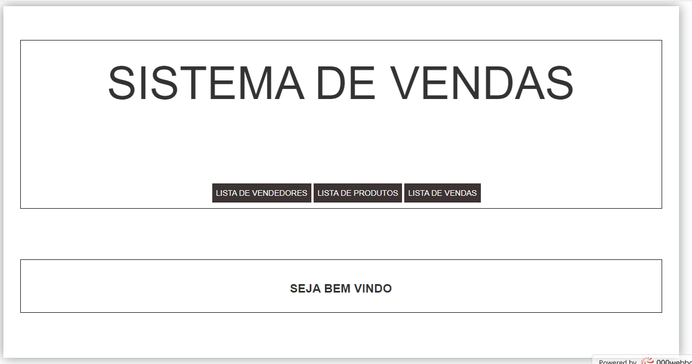
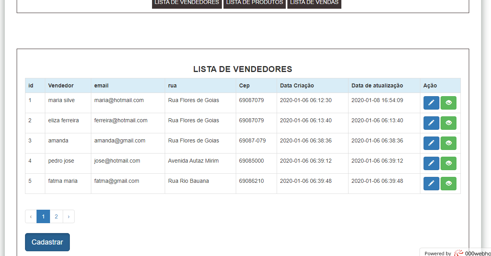
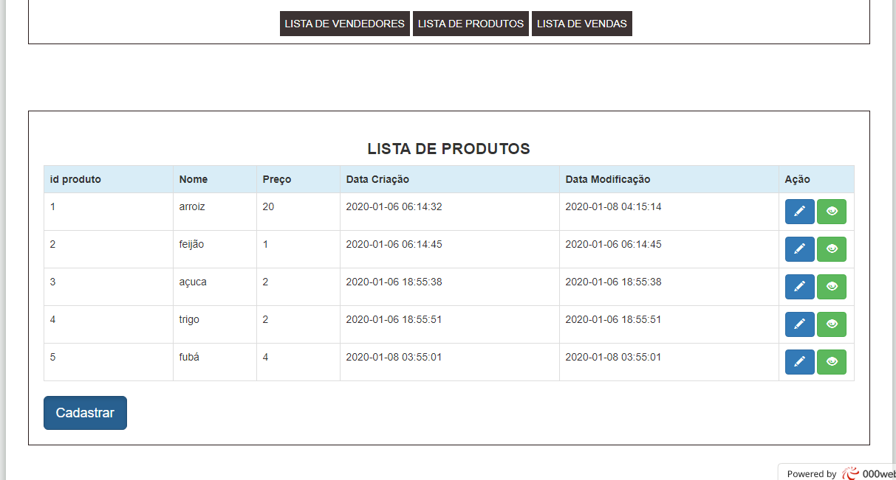
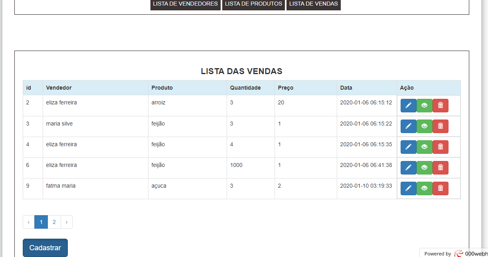
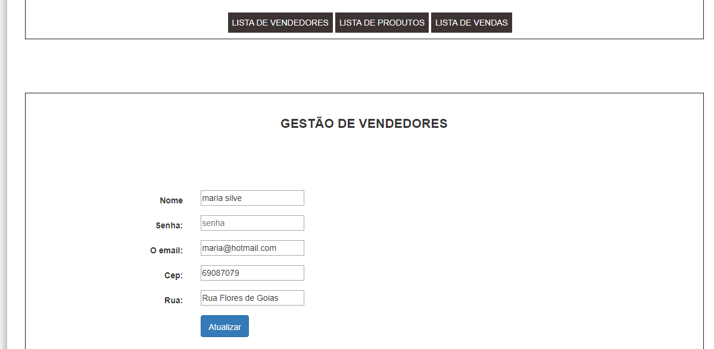
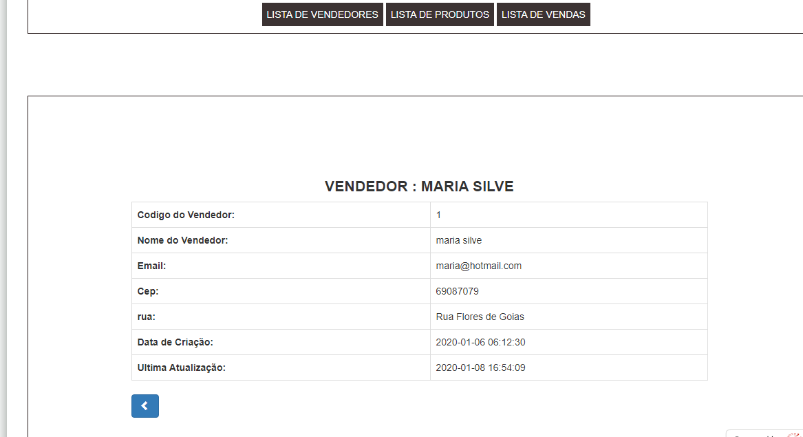
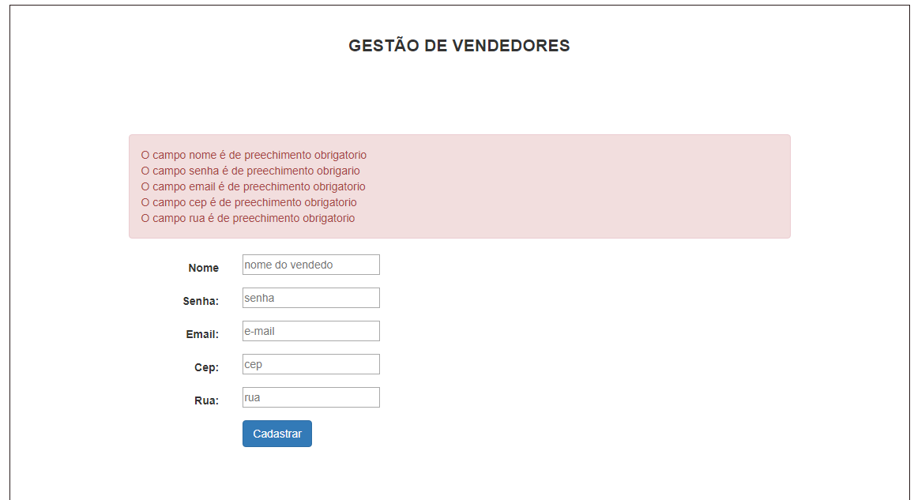

# Crud Laravel - (Laravel/framework: V 6.2)

## Apresentação do sistema















## Instalação

Requisitos
```bash
Versão do PHP = 7.2
```

Fazer o download e iniciar a instalação 
```bash
- fazer o download em arquivo .zip
- extraia o conteudo
- abri a pasta do projeto no terminal
- executo os comandos abaixa no terminal
```

Instala o composer
```bash
$ composer install
```

Copia arquivo .env
```bash
$ cp .env.example .env
```

Gera chave
```bash
$ php artisan key:generate
```

Cria um banco de dados vazio (MySQL)

Configurar o banco de dados no arquivo .env
```bash
DB_CONNECTION=mysql
DB_HOST=127.0.0.1
DB_PORT=3306
DB_DATABASE=
DB_USERNAME=
DB_PASSWORD=
```

Migra tabelas para o banco de dados
```bash
$ php artisan migrate
```

Roda servidor local na porta 8000
```bash
$ php artisan serve
```